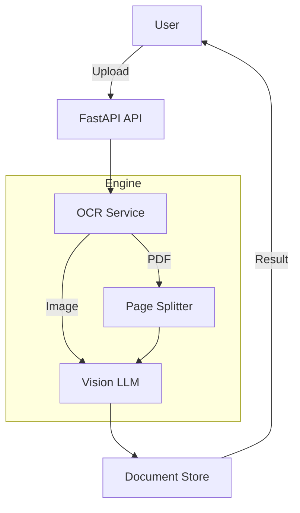

# Raas-OCR Process Workflow

## 1. System Architecture
Modular FastAPI backend leveraging vision-based AI for technical report digitization.



## 2. Extraction Pipeline
| Step | Action | Detail |
| :--- | :--- | :--- |
| **Ingestion** | File Upload | Supports PDF, PNG, JPG via `/api/ocr/extract`. |
| **Conversion** | PDF to Image | 200 DPI PNG conversion via `pdf2image`. |
| **Detection** | Category identification | **Pass 1:** LLM identifies report type (VCB, PT, CT, etc.). |
| **Extraction** | Vision-to-JSON | **Pass 2:** LLM extracts title and specific page fields. |
| **Storage** | Persistence | In-memory storage of PNG bytes and Pydantic models. |
| **Sync** | UI Navigation | Linked retrieval by `document_id` and `page_number`. |

---

## 3. AI Implementation (GPT-4o-mini)

### 3.1 LLM Initialization
The LLM is initialized once as part of the `OCRService` class using LangChain's `ChatOpenAI`:

```python
# services/ocr_service.py
class OCRService:
    def __init__(self):
        self.llm = ChatOpenAI(
            model="gpt-4o-mini",
            temperature=0,       # Deterministic output, no creativity
            max_tokens=4096      # Enough room for large JSON responses
        )
```
- **temperature=0**: We need consistent, repeatable results — not creative text.
- **max_tokens=4096**: Reports can have 50+ fields; this ensures the full JSON fits in the response.

---

### 3.2 Pass 1 — Document Type Detection (`_detect_document_type`)

**Purpose**: Identify the report category from the first page so we can select the correct extraction schema.

**Actual System Instruction used in our project:**
```python
# services/ocr_service.py — _detect_document_type()

prompt = f"""Look at this document image and identify its type based on the title/heading.

Respond with ONLY ONE of these exact document type names:
- "PT TEST REPORT"
- "CT TEST REPORT"
- "TEST CERTIFICATE OF NUMERICAL RELAY RMU"
- "RELEASE TEST REPORT"
- "CHECK - LIST OF MVS ACB/MCCB SERVICING"
- "TEST REPORT OF POSTAL TRANSFORMER"
- "TEST REPORT OF CURRENT TRANSFORMER"
- "TEST CERTIFICATE OF POWER TRANSFORMER"
- "ROUTINE TEST CERTIFICATE (VACUUM CIRCUIT BREAKER)"
- "OTHER" if it doesn't match any of the above

Look at the title at the top of the document. Return the EXACT matching type name.
RESPOND WITH ONLY THE TYPE VALUE IN QUOTES, NOTHING ELSE."""
```

**How we send it to the LLM (Vision API call):**
```python
message = HumanMessage(
    content=[
        {"type": "text", "text": prompt},
        {
            "type": "image_url",
            "image_url": {"url": f"data:image/png;base64,{img_base64}"}
        }
    ]
)

response = self.llm.invoke([message])
doc_type = response.content.strip().replace('"', '').replace("'", "")
```

**Post-processing — Fuzzy matching to handle LLM variations:**
```python
# Even if the LLM returns a slightly different string, we match it
for dt in DOCUMENT_TYPES:
    if dt.lower() in doc_type.lower() or doc_type.lower() in dt.lower():
        return dt

# Exact match fallback
if doc_type in DOCUMENT_TYPES:
    return doc_type

return "OTHER"
```

**Why this design?**
- **Strict list constraint**: Prevents hallucination — the LLM can only return values we have schemas for.
- **"NOTHING ELSE" rule**: Stops conversational filler that would break parsing.
- **Fuzzy fallback**: Handles cases where the LLM returns "PT Test Report" instead of "PT TEST REPORT".

---

### 3.3 The Logic Bridge — How Pass 1 Connects to Pass 2

The detected type is used to look up report-specific field keys from `models/schemas.py`:

```python
# services/ocr_service.py — _process_pdf() loop

for i, img in enumerate(images):
    # Pass 1: Only on the FIRST page
    if i == 0 and not doc_type:
        detected_type = await self._detect_document_type(img)

    # Bridge: Select correct keys based on detected type
    use_type = doc_type or detected_type
    if keys:
        use_keys = keys                              # User-provided custom keys
    elif use_type and use_type in DOCUMENT_TYPE_KEYS:
        use_keys = DOCUMENT_TYPE_KEYS[use_type]      # Schema-specific keys (e.g., VCB_KEYS)
    else:
        use_keys = DEFAULT_EXTRACTION_KEYS           # Generic fallback

    # Pass 2: Extract fields using the selected keys
    page_data = await self._extract_from_image(img, i + 1, use_keys, use_type)
```

**Key insight**: Pass 1 runs **once** (first page only). Its result drives **every** page's extraction in Pass 2.

---

### 3.4 Pass 2 — Intelligent Field Extraction (`_extract_from_image`)

**Purpose**: Extract all handwritten/printed values from each page image.

**Actual System Instruction used in our project:**
```python
# services/ocr_service.py — _build_extraction_prompt()

prompt = f"""Analyze this electrical test report document and extract ALL handwritten/filled values.

DOCUMENT TYPE: {doc_type or "Auto-detect from title"}

TASK 1 - IDENTIFY THE TITLE:
Find the main title/heading of this document (usually at the top).

TASK 2 - EXTRACT ALL FIELDS:
Look for these fields and extract their handwritten/printed values:
- Client
- Plant
- Serial No.
- Contact Resistance R-Phase
- ... (up to 50 report-specific keys)

EXTRACTION RULES:
1. Extract EVERY value you can read from the document
2. For tables, extract each cell value with a descriptive key
3. For checkboxes/tick marks, indicate "Yes", "No", "Checked", "OK" etc.
4. If a field is empty or not visible, skip it
5. Include units where applicable (e.g., "5 KV", "100 μΩ")

RESPOND IN THIS EXACT JSON FORMAT:
{{
    "title": "Document title as shown",
    "category": "{doc_type or 'detected_type'}",
    "fields": [
        {{"key": "Field Name", "value": "extracted value"}},
        {{"key": "Another Field", "value": "its value"}},
        ...
    ]
}}

IMPORTANT: Only return valid JSON. Extract as many fields as possible."""
```

**How we send it and parse the response:**
```python
# services/ocr_service.py — _extract_from_image()

# Convert image to base64
buffered = io.BytesIO()
image.save(buffered, format="PNG")
img_base64 = base64.b64encode(buffered.getvalue()).decode()

# Build prompt with document-specific keys
prompt = self._build_extraction_prompt(doc_type, keys)

# Call GPT-4o-mini with vision
message = HumanMessage(
    content=[
        {"type": "text", "text": prompt},
        {
            "type": "image_url",
            "image_url": {"url": f"data:image/png;base64,{img_base64}"}
        }
    ]
)

response = self.llm.invoke([message])
result = self._parse_llm_response(response.content)

# Map to Pydantic model
return PageData(
    page_number=page_num,
    title=result.get("title", doc_type),
    category=result.get("category", doc_type),
    extracted_fields=[
        ExtractedField(key=f["key"], value=f["value"])
        for f in result.get("fields", [])
    ]
)
```

**Why each extraction rule?**
| Rule | Why |
| :--- | :--- |
| "Extract EVERY value" | Technical reports have faint handwriting — forces the AI to be aggressive. |
| "For tables, extract each cell" | Converts visual grid layouts into flat key-value pairs for database storage. |
| "Checkboxes → Yes/No/Checked" | Translates visual symbols (✓, ✗) into machine-readable semantic values. |
| "Skip empty fields" | Prevents noise — empty cells would pollute the extracted dataset. |
| "Include units" | Critical for electrical data — "5" alone is meaningless without "KV" or "mΩ". |

---

### 3.5 JSON Response Parsing (`_parse_llm_response`)

The LLM sometimes wraps JSON in markdown code blocks. Our parser handles this:

```python
# services/ocr_service.py — _parse_llm_response()

def _parse_llm_response(self, content: str) -> dict:
    content = content.strip()

    # Strip markdown code fences if present
    if "```json" in content:
        content = content.split("```json")[1].split("```")[0]
    elif "```" in content:
        content = content.split("```")[1].split("```")[0]

    try:
        return json.loads(content.strip())
    except json.JSONDecodeError:
        # Fallback: return raw text so data is never lost
        return {
            "title": "Parse Error",
            "category": "other",
            "fields": [{"key": "raw_response", "value": content[:500]}]
        }
```

**Why?** Even if the LLM returns malformed JSON, we never lose the extracted text — it gets saved as a raw string for manual review.

---

## 4. Supported Reports
- **Breakers**: VCB (Vacuum Circuit Breaker).
- **Transformers**: PT (Potential Transformer), CT (Current Transformer), Power Transformer.
- **Relays**: Numerical Relay RMU, Release Test Report.
- **Service**: ACB/MCCB Checklists, Postal Transformer.

## 5. Technology Stack
- **Engine**: GPT-4o-mini (Vision API)
- **Framework**: FastAPI (Python)
- **Image**: pdf2image / Pillow
- **Data**: Pydantic / LangChain
